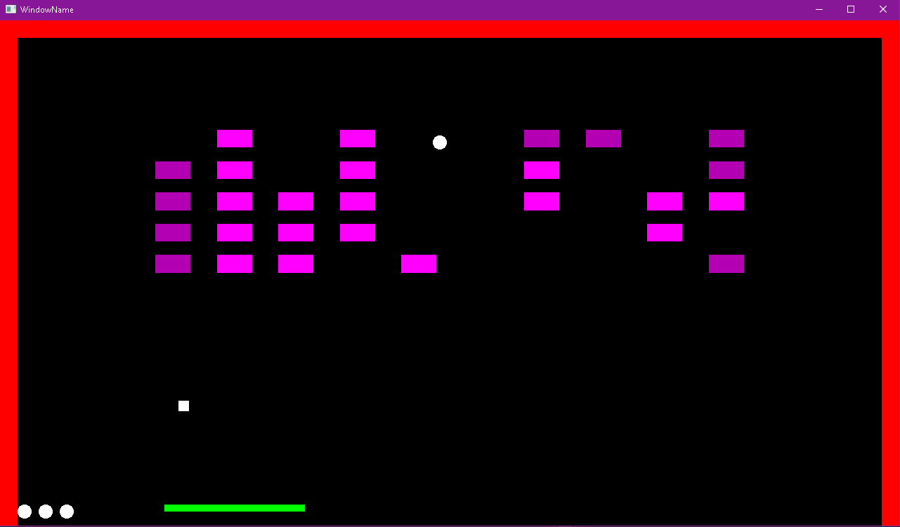

### Description: ###
Brick breaker game implemented in C++ using OpenGL.

Move the mouse to move the platform left and right and click the left mouse button to launch the ball.

The ball will collide with the walls, bricks and platform. The bricks and walls will reflect the ball in a natural way, whereas the platfrom's reflection angle will take into consideration the distance from the inpact point to the middle of the platform.

To clear the level, the user must destroy all bricks with the ball. Most bricks will be destroyed in one collision, but there are bricks which will be destroyed in two or three collisions. There is also a final brick (blue) which must be destroyed last.

There are also powerup which will enlarge the ball, enlarge the platform and disable bricks collisions' reflection.

The game has three levels, the first one being the easiest and the last one the hardest. Each level has different amount of bricks in the scene, lives and different powerups probabilities and ball speed.

To finish a level, the user must destroy all bricks without losing all the lives. After finishing the last level, the user will be promted the first level. When losing a level, the user will be promted to the first level.

#### Known bug: ####
The game uses discrete collisions and, in some cases, the ball can get in an infinite loop of colliding and reflecting off a wall until it exists the scene. More lives have been added to levels with higher probability of this bug's occurrence.

### Screenshots: ###

### References: ###
Collsion algorithm: https://stackoverflow.com/a/402010 \
Reflection algorithm: https://gamedev.stackexchange.com/a/10917
